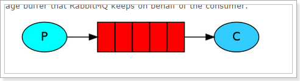
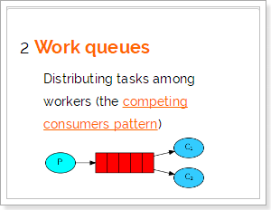
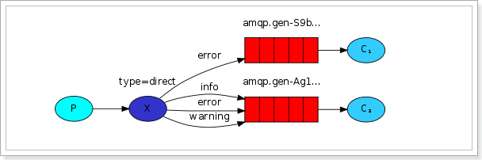

# RabbitMQ五种消息模型

RabbitMQ提供了6种消息模型，但是第6种其实是RPC，并不是MQ，因此不予学习。那么也就剩下5种。

但是其实3、4、5这三种都属于订阅模型，只不过进行路由的方式不同。

## 1.基本消息模型

RabbitMQ是一个消息代理：它接受和转发消息。 你可以把它想象成一个邮局：当你把邮件放在邮箱里时，你可以确定邮差先生最终会把邮件发送给你的收件人。 在这个比喻中，RabbitMQ是邮政信箱，邮局和邮递员。

RabbitMQ与邮局的主要区别是它不处理纸张，而是接受，存储和转发数据消息的二进制数据块。

P（producer/ publisher）：生产者，一个发送消息的用户应用程序。

C（consumer）：消费者，消费和接收有类似的意思，消费者是一个主要用来等待接收消息的用户应用程序

队列（红色区域）：rabbitmq内部类似于邮箱的一个概念。虽然消息流经rabbitmq和你的应用程序，但是它们只能存储在队列中。队列只受主机的内存和磁盘限制，实质上是一个大的消息缓冲区。许多生产者可以发送消息到一个队列，许多消费者可以尝试从一个队列接收数据。

总之：

生产者将消息发送到队列，消费者从队列中获取消息，队列是存储消息的缓冲区。

## 2.work消息模型

在第一篇教程中，我们编写了一个程序，从一个命名队列中发送并接受消息。在这里，我们将创建一个工作队列，在多个工作者之间分配耗时任务。

工作队列，又称任务队列。主要思想就是避免执行资源密集型任务时，必须等待它执行完成。相反我们稍后完成任务，我们将任务封装为消息并将其发送到队列。 在后台运行的工作进程将获取任务并最终执行作业。当你运行许多工人时，任务将在他们之间共享，但是一个消息只能被一个消费者获取。

这个概念在Web应用程序中特别有用，因为在短的HTTP请求窗口中无法处理复杂的任务。

接下来我们来模拟这个流程：

​    P：生产者：任务的发布者

​    C1：消费者，领取任务并且完成任务，假设完成速度较快

​    C2：消费者2：领取任务并完成任务，假设完成速度慢

## 2.3.订阅模型分类

在之前的模式中，我们创建了一个工作队列。 工作队列背后的假设是：每个任务只被传递给一个工作人员。 在这一部分，我们将做一些完全不同的事情 - 我们将会传递一个信息给多个消费者。 这种模式被称为“发布/订阅”。 

订阅模型示意图：

 

解读：

1、1个生产者，多个消费者

2、每一个消费者都有自己的一个队列

3、生产者没有将消息直接发送到队列，而是发送到了交换机

4、每个队列都要绑定到交换机

5、生产者发送的消息，经过交换机到达队列，实现一个消息被多个消费者获取的目的

X（Exchanges）：交换机一方面：接收生产者发送的消息。另一方面：知道如何处理消息，例如递交给某个特别队列、递交给所有队列、或是将消息丢弃。到底如何操作，取决于Exchange的类型。

Exchange类型有以下几种：

​         Fanout：广播，将消息交给所有绑定到交换机的队列

​         Direct：定向，把消息交给符合指定routing key 的队列

​         Topic：通配符，把消息交给符合routing pattern（路由模式） 的队列

我们这里先学习

​	Fanout：即广播模式

**Exchange（交换机）只负责转发消息，不具备存储消息的能力**，因此如果没有任何队列与Exchange绑定，或者没有符合路由规则的队列，那么消息会丢失！

## 2.4.订阅模型-Fanout

Fanout，也称为广播。

流程图：

在广播模式下，消息发送流程是这样的：

- 1）  可以有多个消费者
- 2）  每个**消费者有自己的queue**（队列）
- 3）  每个**队列都要绑定到Exchange**（交换机）
- 4）  **生产者发送的消息，只能发送到交换机**，交换机来决定要发给哪个队列，生产者无法决定。
- 5）  交换机把消息发送给绑定过的所有队列
- 6）  队列的消费者都能拿到消息。实现一条消息被多个消费者消费

## 2.5.订阅模型-Direct

有选择性的接收消息

在订阅模式中，生产者发布消息，所有消费者都可以获取所有消息。

在路由模式中，我们将添加一个功能 - 我们将只能订阅一部分消息。 例如，我们只能将重要的错误消息引导到日志文件（以节省磁盘空间），同时仍然能够在控制台上打印所有日志消息。

但是，在某些场景下，我们希望不同的消息被不同的队列消费。这时就要用到Direct类型的Exchange。

在Direct模型下，队列与交换机的绑定，不能是任意绑定了，而是要指定一个RoutingKey（路由key）

消息的发送方在向Exchange发送消息时，也必须指定消息的routing key。

 

P：生产者，向Exchange发送消息，发送消息时，会指定一个routing key。

X：Exchange（交换机），接收生产者的消息，然后把消息递交给 与routing key完全匹配的队列

C1：消费者，其所在队列指定了需要routing key 为 error 的消息

C2：消费者，其所在队列指定了需要routing key 为 info、error、warning 的消息

## 2.6.订阅模型-Topic

`Topic`类型的`Exchange`与`Direct`相比，都是可以根据`RoutingKey`把消息路由到不同的队列。只不过`Topic`类型`Exchange`可以让队列在绑定`Routing key` 的时候使用通配符！

`Routingkey` 一般都是有一个或多个单词组成，多个单词之间以”.”分割，例如： `item.insert`

 通配符规则：

​         `#`：匹配一个或多个词

​         `*`：匹配不多不少恰好1个词

举例：

​         `audit.#`：能够匹配`audit.irs.corporate` 或者 `audit.irs`

​         `audit.*`：只能匹配`audit.irs`

 

在这个例子中，我们将发送所有描述动物的消息。消息将使用由三个字（两个点）组成的routing key发送。路由关键字中的第一个单词将描述速度，第二个颜色和第三个种类：“<speed>.<color>.<species>”。

我们创建了三个绑定：Q1绑定了绑定键“* .orange.*”，Q2绑定了“*.*.rabbit”和“lazy.＃”。

Q1匹配所有的橙色动物。

Q2匹配关于兔子以及懒惰动物的消息。

## 解决消息丢失

1. ack(消费者确认)   --通过手动确认的方式
2. 持久化
   1. 交换机持久化
   2. 队列持久化
   3. 消息持久化
3. 生产者确认机制 或 发送新消息前，将消息持久化到数据库，并记录消息状态

幂等性(统一接口被重复执行， 其结果一致)